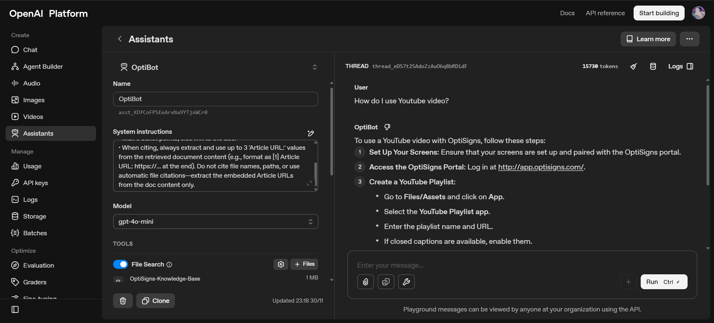

# cryptic-minibot

A small pipeline that scrapes OptiSigns Support Center articles, stores processed Markdown files on DigitalOcean Spaces, and syncs them into an OpenAI Vector Store used by OptiBot.

---

## ⚙️ Setup

```
git clone <your-repo-url>
cd optibot-pipeline
python -m venv venv
venv\Scripts\activate  # Windows
source venv/bin/activate # macOS/Linux
pip install -r requirements.txt
```

Create `.env`:

```
OPENAI_API_KEY=
SPACES_KEY=
SPACES_SECRET=
SPACES_ENDPOINT=
SPACES_BUCKET=
DISCORD_WEBHOOK_URL=
```

---

## ▶️ Run Locally

```
python main.py
```

---

## 📄 Daily Job Logs

Daily job runs on DigitalOcean and reports to Discord:  
🔗 https://discord.gg/pRmdGdeaAz

---

## 🧩 Chunking Strategy (Short Version)

- Extract metadata (title, URL, article ID)
- Split body by paragraphs
- Create subchunks ≤ **600 tokens** using `tiktoken`
- Each chunk gets metadata + uploaded separately to Spaces → Vector Store

---

## 🖼️ Playground Screenshot


Example: OptiBot answering based on uploaded documents in OpenAI Playground.

---

## 📁 Structure

```
main.py
src/
 ├── scraper.py
 ├── vector_ops.py
 ├── spaces.py
```
